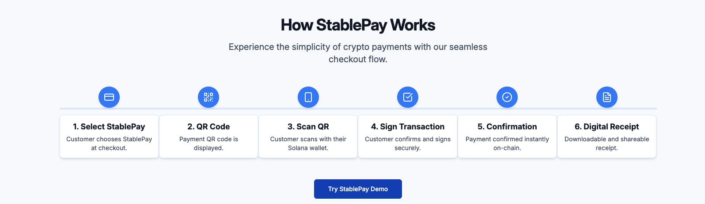

#  StablePay

<div align="center">
  
[](https://reactjs.org/)
[](https://www.typescriptlang.org/)
[](https://vitejs.dev/)
[](https://solana.com/)
[](https://tailwindcss.com/)
[](https://expressjs.com/)
[](https://www.anchor-lang.com/)
[](LICENSE)

</div>

<p align="center">
  <b>🚀 Enterprise-grade stablecoin payment processing on Solana 🚀</b><br/>
  Accept multiple stablecoins, generate yield on treasury, and build better financial experiences
</p>

<p align="center">
  
</p>

## ✨ Features

- **🪙 Multi-Stablecoin Support** - Accept USDC, USDT, DAI and more with optimal settlement rates
- **🧾 Digital Receipts** - Offer downloadable, shareable receipts for all transactions
- **📊 Real-time Status Updates** - Visual progress indicators and instant notifications
- **🔗 Transaction Transparency** - Direct Solana Explorer links for full verification
- **👛 Enhanced Wallet Experience** - Smart detection with guided connection process
- **📈 Yield Generation** - Automatically generate yield on your stablecoin balance
- **⚡ Lightning Fast** - Instant transactions with sub-second confirmation times
- **♿ Accessibility First** - Comprehensive ARIA support and keyboard navigation

## 🚀 Quick Start

### Prerequisites

- Node.js 16+ and npm/yarn/bun
- Git
- Solana CLI (for Anchor development)
- PostgreSQL (for backend database)

### Installation

```bash
# Clone the repository
git clone https://github.com/FarseenSh/StablePay.git

# Navigate to project directory
cd StablePay

# Install frontend dependencies
npm install
# or
yarn
# or
bun install

# Install backend dependencies
cd backend
npm install
cd ..

# Install Anchor dependencies (optional, for smart contract development)
cd backend/anchor
npm install
cd ../..
```

### Running the Application

#### 1. Start the Backend Server

```bash
# Set up environment variables
cd backend
cp .env.example .env
# Edit .env with your configuration

# Start the development server
npm run dev

# Or build and run production mode
npm run build
npm start
```

#### 2. Start the Frontend

```bash
# In the root directory
npm run dev
# or
yarn dev
# or
bun dev
```

Visit `http://localhost:5173` to view the frontend application.
The backend API will be available at `http://localhost:3000`.

## 🏗️ Build & Deployment

### Building for Production

#### Frontend

```bash
# Generate production build
npm run build
# or
yarn build
# or
bun build
```

This creates a `dist` folder with optimized, minified assets ready for deployment.

#### Backend

```bash
cd backend

# Build the TypeScript code
npm run build

# The compiled code will be in the dist/ directory
```

### Preview Production Build

```bash
# Locally preview frontend production build
npm run preview
# or
yarn preview
# or
bun preview
```

### Smart Contract Deployment

```bash
cd backend/anchor

# Build the Anchor program
npm run build

# Deploy to Solana devnet (requires Solana CLI)
npm run deploy

# Run contract tests
npm run test
```

### Deployment Options

#### Frontend (Static Hosting)
Deploy the contents of the `dist` directory to any static hosting service:

- Vercel
- Netlify
- GitHub Pages
- AWS S3 + CloudFront
- Firebase Hosting

#### Backend (Server Hosting)
Deploy the backend to a Node.js-compatible environment:

- Heroku
- AWS EC2/ECS
- Google Cloud Run
- Azure App Service
- Digital Ocean App Platform

#### Example: Full-Stack Deployment

```bash
# Build both frontend and backend
npm run build
cd backend && npm run build

# Deploy backend to Heroku
cd backend
heroku create stablepay-api
git init
git add .
git commit -m "Deploy backend"
git push heroku main

# Deploy frontend to Vercel
cd ..
vercel
```

## 🏗️ Project Structure

```
StablePay/
├── public/               # Static assets
├── src/                  # Frontend source
│   ├── components/       # Reusable UI components
│   ├── flows/            # Workflow demonstrations
│   ├── hooks/            # Custom React hooks
│   ├── lib/              # Utility functions
│   ├── pages/            # Application pages
│   ├── providers/        # React context providers
│   ├── types/            # TypeScript type definitions
│   ├── App.tsx           # Main application component
│   └── main.tsx          # Application entry point
├── backend/              # Backend server
│   ├── src/              # Backend source code
│   ├── anchor/           # Solana smart contracts
│   │   ├── programs/     # Anchor programs
│   │   └── tests/        # Contract tests
│   ├── .env.example      # Example environment variables
│   └── package.json      # Backend dependencies
├── .gitignore            # Git ignore file
├── index.html            # HTML entry point
├── package.json          # Frontend dependencies and scripts
├── tsconfig.json         # TypeScript configuration
└── vite.config.ts        # Vite configuration
```

## 💻 Technology Stack

### Frontend
- **Framework**: React 18 with TypeScript
- **Build Tool**: Vite
- **Styling**: Tailwind CSS with shadcn/ui components
- **State Management**: React Context API and hooks
- **Blockchain**: Solana Web3.js
- **Wallet Integration**: Solana Wallet Adapter
- **Routing**: React Router

### Backend
- **Server**: Node.js with Express
- **Database**: PostgreSQL
- **Authentication**: JWT
- **Blockchain**: Solana Web3.js
- **Smart Contracts**: Anchor framework
- **Testing**: Jest, Supertest
- **Logging**: Winston

## 🔧 Configuration

### Frontend Configuration

Create a `.env` file in the root directory with:

```
VITE_SOLANA_NETWORK=mainnet-beta  # or devnet or testnet
VITE_API_ENDPOINT=https://your-api-endpoint.com
```

### Backend Configuration

Create a `.env` file in the backend directory:

```
# Server configuration
PORT=3000
NODE_ENV=development

# JWT Authentication
JWT_SECRET=your-jwt-secret-key
JWT_EXPIRATION=24h

# Solana configuration
SOLANA_RPC_URL=https://api.devnet.solana.com
SOLANA_PRIVATE_KEY=your-private-key

# Perena Integration
PERENA_API_URL=https://api.perena.io
PERENA_API_KEY=your-perena-api-key

# Logging
LOG_LEVEL=info

# CORS
ALLOWED_ORIGINS=http://localhost:8086,http://localhost:3001

# Security
RATE_LIMIT_WINDOW=15m
RATE_LIMIT_MAX_REQUESTS=100
```

For production deployments, set these variables in your hosting platform's environment configuration.

## 🌐 Browser Compatibility

StablePay is optimized for the following browsers:

| Browser | Minimum Version |
|---------|-----------------|
| Chrome  | 83+             |
| Firefox | 78+             |
| Safari  | 14+             |
| Edge    | 83+             |
| Opera   | 69+             |

Mobile browsers are fully supported on iOS 14+ and Android 8+.

## ❓ Troubleshooting & FAQ

### Wallet Connection Issues

- Ensure you're using a supported Solana wallet (Phantom, Solflare, etc.)
- Clear browser cache and reload the page
- Check if you're on the correct Solana network (mainnet/devnet)

### Transaction Failures

- Verify your wallet has sufficient SOL for gas fees
- Check your wallet's USDC/USDT balance
- Ensure you've allowed the DApp connection in your wallet

### Build Errors

- Run `npm clean-install` to refresh dependencies
- Ensure Node.js version is 16+
- Check if `.env` variables are correctly set

### Backend Issues

- Verify PostgreSQL is running and accessible
- Check backend logs for specific error messages
- Ensure environment variables are properly configured
- Confirm the Solana RPC endpoint is responsive

### Smart Contract Errors

- Verify you have the correct Solana CLI version
- Ensure your wallet has enough SOL for deployment
- Check Anchor version compatibility (0.26.0+)

## 🤝 Contributing

Contributions are welcome! Please feel free to submit a Pull Request.

1. Fork the repository
2. Create your feature branch (`git checkout -b feature/amazing-feature`)
3. Commit your changes (`git commit -m 'Add some amazing feature'`)
4. Push to the branch (`git push origin feature/amazing-feature`)
5. Open a Pull Request

## 📄 License

This project is licensed under the MIT License - see the [LICENSE](LICENSE) file for details.

## 📊 Competitive Advantages

| Feature | StablePay | Traditional Payment Processors | Other Crypto Solutions | Solana Pay |
|---------|:---------:|:-----------------------------:|:----------------------:|:----------:|
| Transaction Fees | 70-80% lower | High | Medium | Low |
| Settlement Time | Instant | 2-3 days | Hours | Instant |
| Chargebacks | None | Common | Rare | None |
| Yield Generation | ✅ | ❌ | ❌ | ❌ |
| Multi-stablecoin | ✅ | ❌ | Limited | Limited |
| Enterprise Tools | ✅ | ✅ | Limited | ❌ |
| Analytics | Advanced | Basic | Basic | Minimal |

## 🛣️ Roadmap

- **Q2 2025**: Launch MVP with core functionality
- **Q3 2025**: Enhanced treasury management, e-commerce plugins
- **Q4 2025**: Enterprise tier features, multi-chain expansion
- **Q1 2026**: Fiat on/off ramps, mobile applications

## 📩 Contact & Support

- **GitHub Issues**: For bug reports and feature requests
- **Email**: farseenshaikh@gmail.com
- **Twitter**: https://x.com/StablePay_


---

<p align="center">
  <sub>Built with ❤️ by the StablePay team</sub>
</p>
